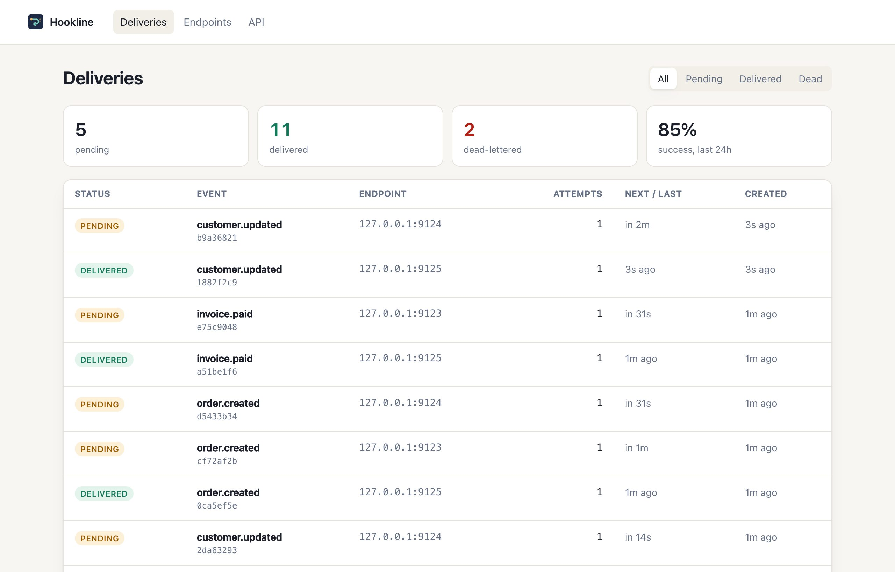
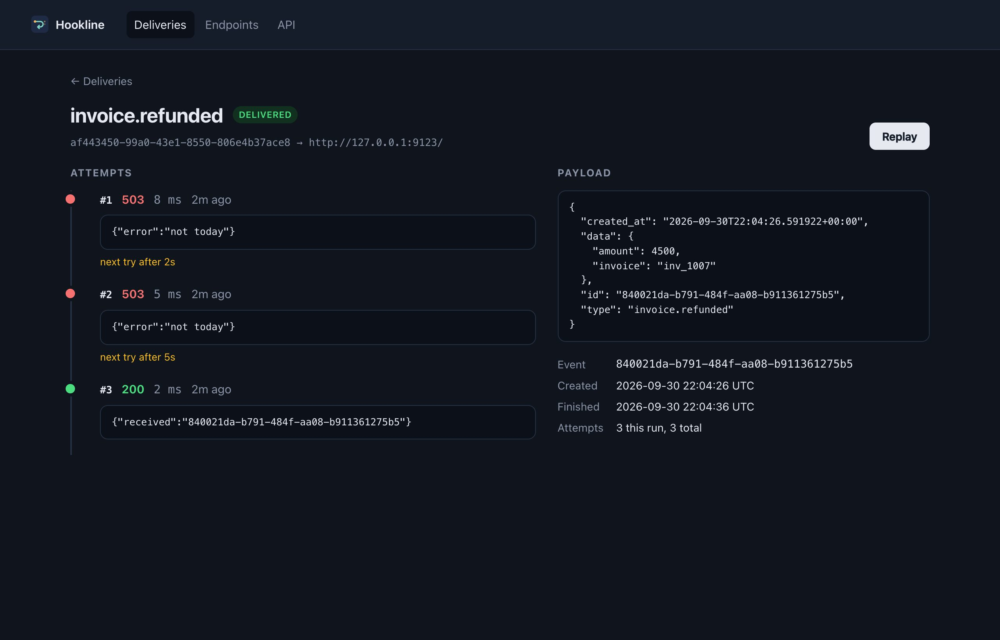

<p align="center">
  
</p>

<h1 align="center">Hookline</h1>

<p align="center">
  Webhook delivery with signatures, retries, a dead-letter queue and a record of every attempt.<br>
  <sub>Python 3.13 · FastAPI · SQLAlchemy 2 · Postgres · SQS · AWS Lambda · Terraform</sub>
</p>

<br>

The name is webhooks put on a line: each one waits its turn, goes out signed, and comes back
for another try until it lands or runs out of attempts. You post an event; Hookline fans it out
to every subscribed endpoint, retries with backoff, parks what never succeeds in a dead-letter
state you can replay, and keeps every attempt with its status code, timing and response, so
"did customer X get event Y?" has an answer a week later.

<p align="center">
  
  
</p>

## Running it

You need Python 3.13 and [uv](https://docs.astral.sh/uv/), or only Docker.

```bash
git clone https://github.com/Brunoskyy/hookline.git && cd hookline
```

**With Docker**, from the repo root, one command starts Postgres, the migrations, the API, a
worker and a demo receiver that fails twice per event before accepting:

```bash
docker compose up --build
```

The API key is `dev-key`, and the receiver is `http://receiver:9000/` from inside compose.
Stop with Ctrl+C; `docker compose down -v` deletes the data.

**Without Docker**, SQLite is enough for a look. Use three terminals, all from the repo root,
each with these variables set first:

```bash
export HOOKLINE_DATABASE_URL=sqlite+aiosqlite:////tmp/hookline.db \
  HOOKLINE_API_KEY=dev-key HOOKLINE_ALLOW_PRIVATE_URLS=true HOOKLINE_BACKOFF_BASE_SECONDS=5
```

1. Terminal 1: `uv sync`, then `uv run hookline init-db`, then `uv run hookline serve`
   (API and dashboard on http://127.0.0.1:8000).
2. Terminal 2: `uv run hookline worker`.
3. Terminal 3: `uv run hookline receiver --fail 2` (listens on port 9000).

Stop each with Ctrl+C and delete `/tmp/hookline.db` to start over. For Postgres instead, copy
`.env.example` to `.env`, set the URL and key there, and run `uv run alembic upgrade head`
in place of `init-db`.

**Send an event** from any terminal. With Docker, use `http://receiver:9000/` as the URL:

```bash
curl -X POST localhost:8000/v1/endpoints -H 'Authorization: Bearer dev-key' \
  -H 'content-type: application/json' \
  -d '{"url": "http://127.0.0.1:9000/", "event_types": ["invoice.paid"]}'
# the response holds the endpoint secret, shown only this once

curl -X POST localhost:8000/v1/events -H 'Authorization: Bearer dev-key' \
  -H 'Idempotency-Key: inv_1042-paid' -H 'content-type: application/json' \
  -d '{"type": "invoice.paid", "data": {"invoice": "inv_1042", "amount": 12900}}'
```

The worker logs two 503s and a 200. Open http://localhost:8000/dashboard and sign in with any
user name and `dev-key` as the password to see the three attempts and the gaps between them.
Sending the event again with the same `Idempotency-Key` returns the first one.

| Command (repo root) | |
| --- | --- |
| `uv run pytest` | 102 tests, plus 4 more with `HOOKLINE_TEST_DATABASE_URL` set to a Postgres |
| `uv run ruff check && uv run mypy` | lint and strict type checking |
| `./infra/build.sh` | the Lambda package, `dist/lambda.zip` |

## How delivery works

```
POST /v1/events ──> event + one delivery per subscribed endpoint
                         │
          worker claims due rows  (FOR UPDATE SKIP LOCKED, with a lease)
                         │
            sign, POST, read ≤ 2 KB of the response
              │                 │                     │
             2xx        failure, attempts left     last attempt failed
              │                 │                     │
          delivered     next try = backoff         dead-lettered
                        (or Retry-After)           (replayable)
```

- **The deliveries table is the queue.** Workers claim due rows with `SKIP LOCKED` and a lease,
  so no two get the same row and a dead worker's lease runs out. Delivery is at-least-once;
  receivers dedupe on `Hookline-Event-Id`.
- **Every attempt has a deadline.** httpx's timeout is per read, so a receiver that drips a byte
  every few seconds would never trip it; the whole attempt is bounded at 20 s instead.
- **Backoff is exponential with jitter:** 30 s, 1 min, 2 min, capped at six hours, and a
  `Retry-After` header wins. After eight attempts the delivery is dead-lettered.
- **A circuit breaker per endpoint:** five consecutive failures rest it for a minute, and
  deliveries due meanwhile are postponed without spending an attempt.
- **The database's clock decides** due times, leases and circuits, so skewed workers agree.
- **No redirects, no private addresses.** URLs that resolve to loopback, private or link-local
  space are refused, including IPv6 wrappers of IPv4, and the connection goes to the address
  that passed the check, so DNS rebinding does not work.

## Signatures

Every request carries a header like:

```
Hookline-Signature: t=1727712000,v1=5257a869e7ecebeda32affa62cdca3fa51cad7e77a0e56ff536d0ce8e108d8bd
```

`v1` is the hex HMAC-SHA256 of `"{t}.{body}"` under the endpoint's secret. Signing the timestamp
with the body lets the receiver refuse a replay of an old request. During a secret rotation the
header carries one `v1` per secret, and any match is enough.

Verifying on the receiving side, with the helper this package ships:

```python
from hookline import verify, SignatureError


@app.post("/webhooks")
async def receive(request: Request):
    body = await request.body()
    try:
        verify(body, request.headers.get("Hookline-Signature"), secret=WEBHOOK_SECRET)
    except SignatureError:
        return Response(status_code=401)
    ...
```

Or in any language: split the header on commas, check `t` is within five minutes of now,
compute the HMAC, and compare in constant time.

## Deploying to AWS

`infra/` has the Terraform, checked with `tofu validate` but not applied from this repository:
API Gateway to a Lambda running the app through Mangum, SQS to a worker Lambda
(`HOOKLINE_QUEUE=sqs`), a one-minute reconciler for rows that outlived their message, RDS
Postgres in private subnets, and a connection budget that fails `tofu plan` if the Lambdas
could exceed `max_connections`.

```bash
./infra/build.sh
cd infra && tofu init && tofu apply \
  -var vpc_id=vpc-... -var 'private_subnet_ids=["subnet-a","subnet-b"]' \
  -var api_key=... -var db_password=...
```

Then run `alembic upgrade head` against the new database from a host that can reach it. The
subnets need a NAT gateway, since the worker has to reach the internet.

## Things worth opening

- **`src/hookline/delivery.py`:** one attempt and every decision taken from its outcome; the
  lease is checked again before writing, so a slow worker never overrules the one that took over.
- **`src/hookline/queues.py`:** the Postgres and SQS queues behind one three-method interface.
- **`src/hookline/signing.py`:** forty lines, with a test that pins the exact bytes signed.
- **`src/hookline/urls.py`:** what it takes for a webhook service not to be an SSRF tool.
- **`src/hookline/service.py`:** idempotency keys racing on a unique index; a reused key with a
  different body is a 409.

## Tests

The 102 tests that run on SQLite cover signatures, backoff and hostile `Retry-After` values,
every IPv6 wrapper of a private address, every API route, the dashboard, and the delivery
engine against a scripted fake receiver, including lost leases, dripping servers and DNS that
changes its answer. SQS, the Lambda handlers and the reconciler run against moto. The 4
Postgres tests prove eight workers never claim the same row and one key makes one event.

## Layout

```
src/hookline/   signing, retry, urls, models, queues, delivery, service, worker,
                api, dashboard (Jinja + htmx), aws (Lambda handlers), receiver
migrations/     Alembic
infra/          Terraform for API Gateway, Lambda, SQS, RDS
```

## What's missing

- One API key for everything; a multi-tenant service needs keys and endpoints per tenant.
- Secrets are stored as given, and the database password goes through a Terraform variable
  where Secrets Manager would be better.
- No rate limit per endpoint beyond the circuit breaker.
